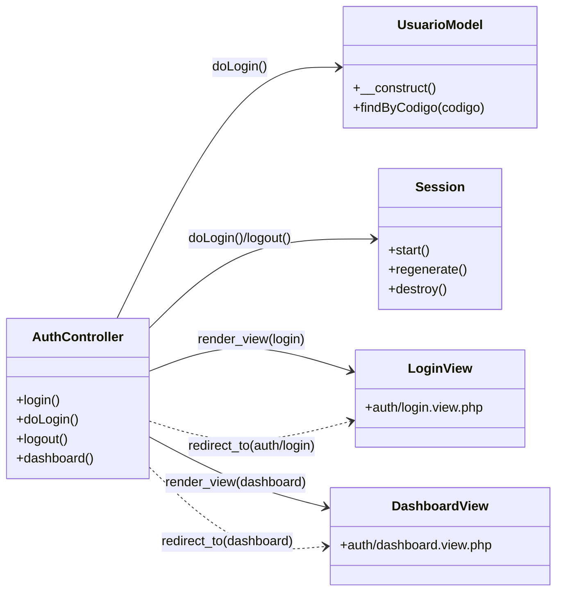
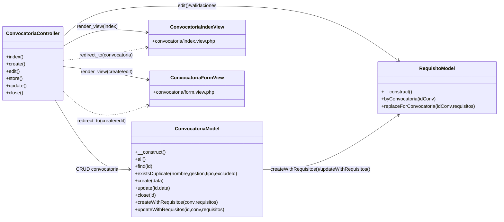
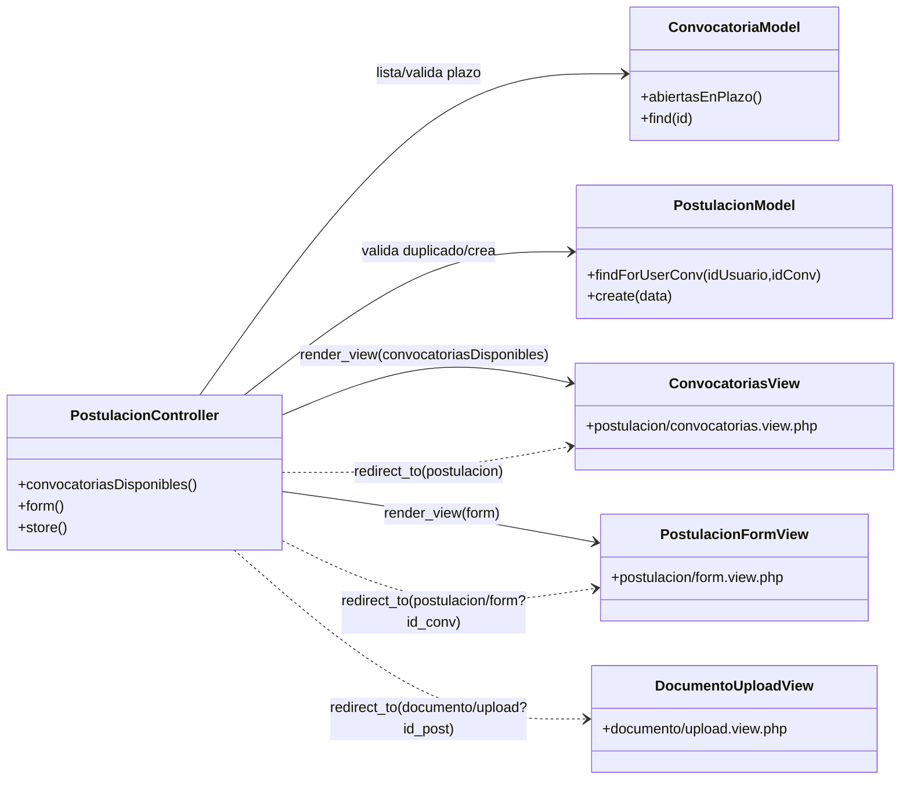
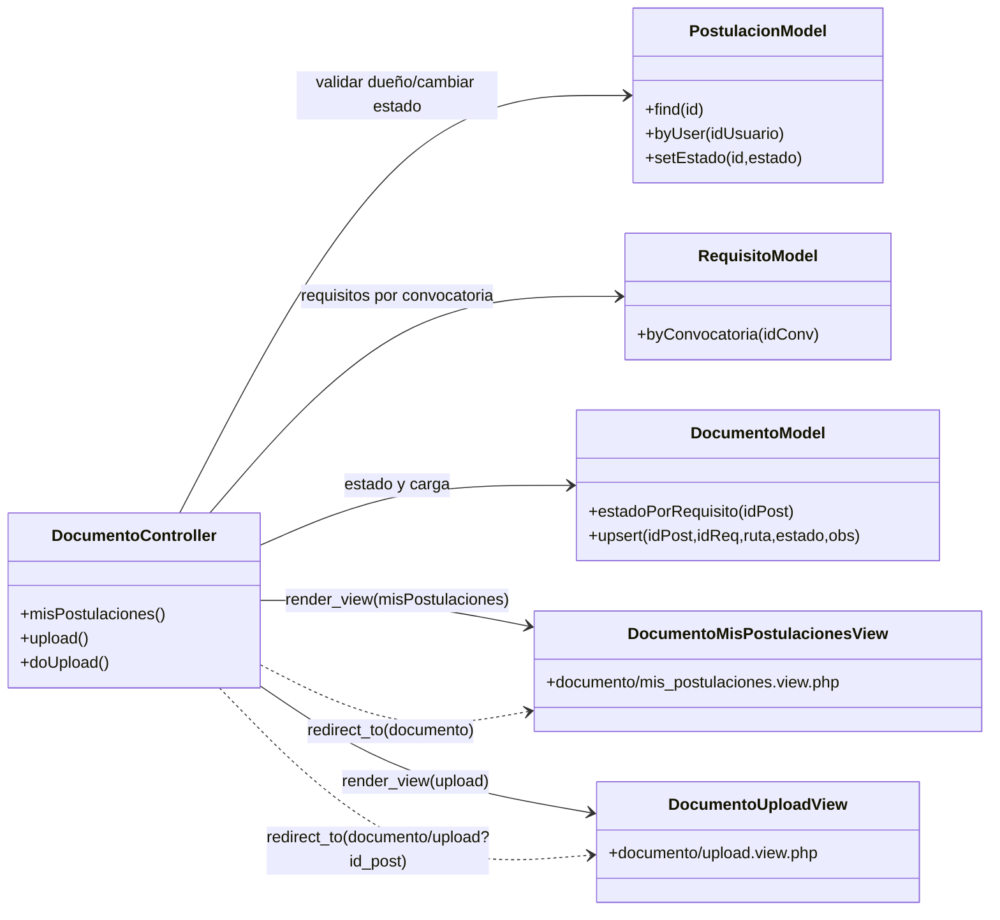
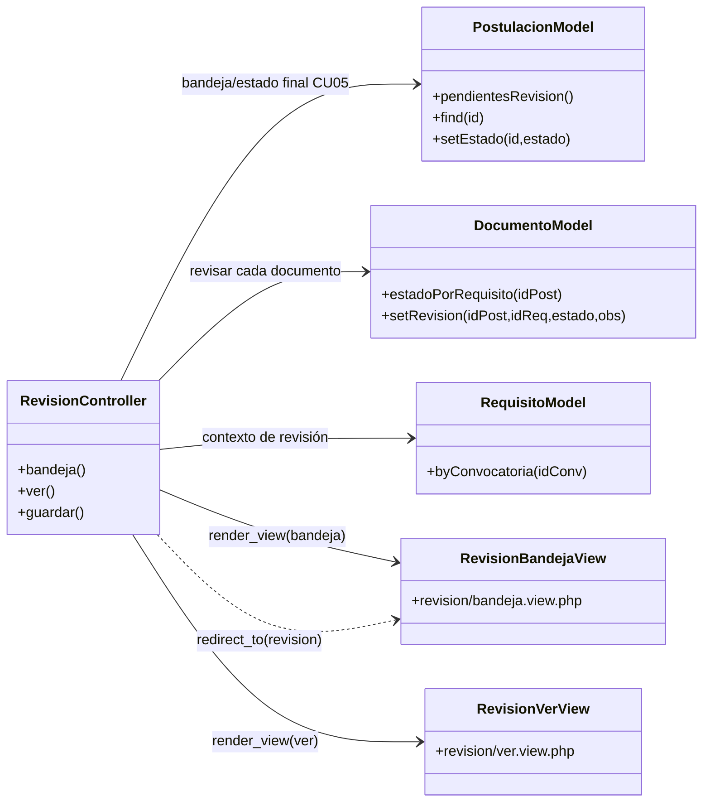
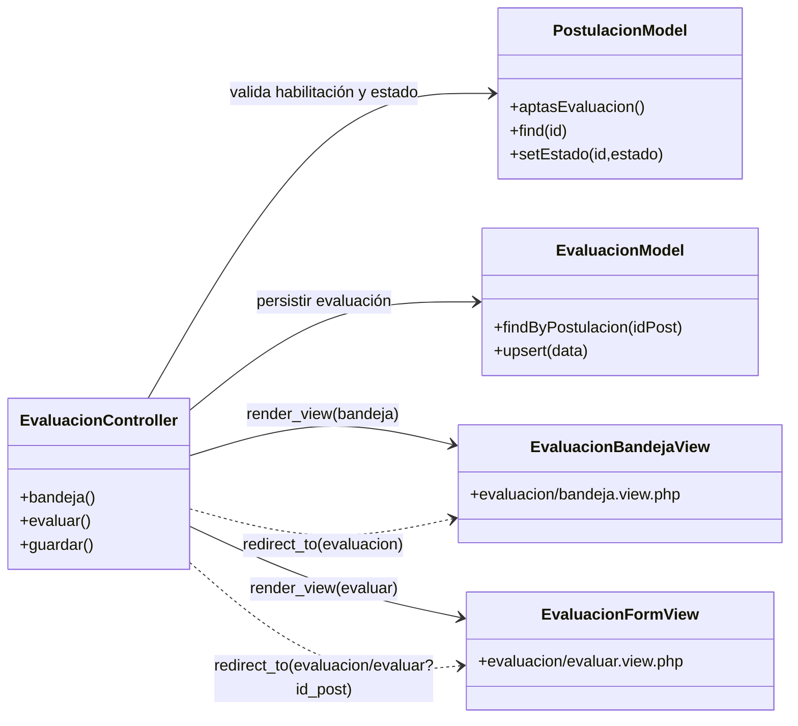
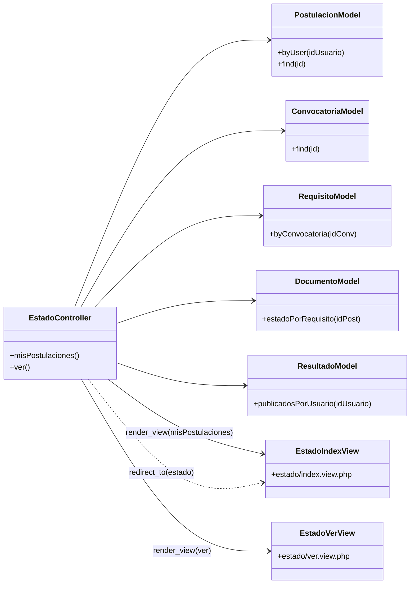
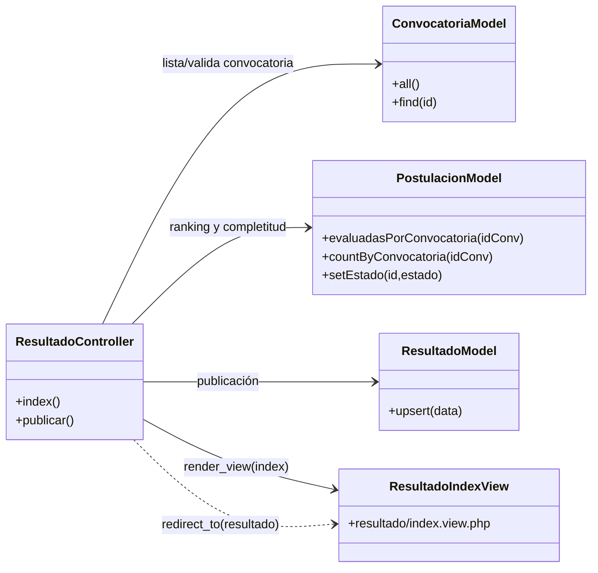

# Becas IDH — MVC Vanilla (PHP + MySQL)

Sistema académico para **gestión de postulación y evaluación de Becas IDH (UAGRM)**, implementado con **arquitectura MVC sin framework**.

## Arquitectura y estructura

- **Entrada única**: `index.php` (Front Controller)
- **Enrutado**: `core/Router.php` + `.htaccess`
- **Capas**:
  - `app/controllers/<paquete>/...`
  - `app/models/<paquete>/...`
  - `app/views/<paquete>/...` (con `layouts/`)
- **Paquetes implementados** (consistentes en controllers/models/views):
  - `auth`
  - `convocatoria`
  - `documento` (placeholder)
  - `evaluacion` (placeholder)

## Casos de uso implementados

### CU01 — Login / Logout

- **Login** por `codigo` + `password`
- **Validaciones**:
  - credenciales incorrectas
  - usuario inactivo
  - contraseña vencida / restablecimiento requerido
- **Sesión segura**:
  - regeneración de ID al iniciar sesión
  - logout con destrucción de sesión
  - protección CSRF en formularios POST
- **Menú por rol** (`/dashboard`): habilita opciones según `$_SESSION['user']['rol']`

Usuario seed (Admin):
- **Código**: `ADM001`
- **Contraseña**: `Admin123!`
- **Rol**: `administrador`

### CU02 — Gestionar convocatoria (Administrador)

Ruta principal: `/convocatoria`

Flujo coherente (acciones + datos):
- **Precondición**: sesión iniciada con rol `administrador` (se fuerza con `requireAuth(['administrador'])`)
- **Crear/Editar convocatoria**:
  - datos: nombre, gestión, tipo de beca, fechas, estado
  - requisitos/documentos exigidos: lista dinámica
  - persistencia consistente: **transacción** (convocatoria + requisitos)
- **Cerrar convocatoria**: cambia el estado a `cerrada`

Validaciones (flujos alternos):
- **Fechas inválidas**: inicio no puede ser mayor a fin
- **Convocatoria duplicada**: clave única (nombre + gestión + tipo)
- **Falta un requisito obligatorio**: debe existir al menos 1 requisito y al menos 1 marcado como obligatorio

## Base de datos

Script SQL: `database/becas_idh.sql`

Tablas incluidas para CU01 + CU02:
- `usuarios`
- `convocatorias`
- `requisitos`

## Configuración

Edita credenciales en `config/config.php`:

- `db.host`
- `db.name` (por defecto: `becas_idh`)
- `db.user`
- `db.pass`

Si sirves el proyecto en un subdirectorio, ajusta:
- `app.base_path`

## Arranque del proyecto

### Opción A — Apache (recomendado)

- Asegúrate de tener habilitado `mod_rewrite`.
- Apunta el DocumentRoot al directorio del proyecto o un VirtualHost.
- La reescritura está en `.htaccess` para redirigir todo a `index.php`.

### Opción B — Servidor embebido de PHP (rápido para pruebas)

> Importante: si ejecutas `php -S ... index.php`, **también interceptas** solicitudes a archivos estáticos (CSS/JS) y **no se aplicarán estilos**. Usa `router.php` para servir assets correctamente.

Ejecuta:

```bash
php -S 127.0.0.1:8000 router.php
```

Luego abre:
- `/auth/login`
- `/dashboard`
- `/convocatoria`

## Seguridad mínima aplicada

- PDO con prepared statements
- Cookies de sesión con `HttpOnly` y `SameSite=Lax`

> Nota de presentación: por requerimiento del docente, **no se usa CSRF** y las contraseñas se comparan en **texto plano** (no recomendado en producción).

## Diagramas (Mermaid)

### Diagramas de clases por CU (MVC real)

#### CU01 — Login / Logout
!img[CU01](./img/CU01-Login-Logout.png)


#### CU02 — Gestionar convocatoria


#### CU03 — Registrar postulación


#### CU04 — Cargar documentación


#### CU05 — Revisar documentación


#### CU06 — Evaluar postulante


#### CU07 — Consultar estado de postulación


#### CU08 — Publicar resultados


### Diagrama de clases global del proyecto

```mermaid
classDiagram
direction LR

class Router {
  +get(path,handler)
  +post(path,handler)
  +dispatch(method,uri)
}
class Session {
  +start()
  +regenerate()
  +destroy()
}
class Database {
  +getInstance()
}

class AuthController {
  +login()
  +doLogin()
  +logout()
  +dashboard()
}
class ConvocatoriaController {
  +index()
  +create()
  +edit()
  +store()
  +update()
  +close()
}
class PostulacionController {
  +convocatoriasDisponibles()
  +form()
  +store()
}
class DocumentoController {
  +misPostulaciones()
  +upload()
  +doUpload()
}
class RevisionController {
  +bandeja()
  +ver()
  +guardar()
}
class EvaluacionController {
  +bandeja()
  +evaluar()
  +guardar()
}
class EstadoController {
  +misPostulaciones()
  +ver()
}
class ResultadoController {
  +index()
  +publicar()
}

class UsuarioModel {
  +findByCodigo(codigo)
}
class ConvocatoriaModel {
  +all()
  +find(id)
  +abiertasEnPlazo()
  +existsDuplicate(nombre,gestion,tipo,excludeId)
  +create(data)
  +update(id,data)
  +close(id)
  +createWithRequisitos(conv,requisitos)
  +updateWithRequisitos(id,conv,requisitos)
}
class RequisitoModel {
  +byConvocatoria(idConv)
  +replaceForConvocatoria(idConv,requisitos)
}
class PostulacionModel {
  +find(id)
  +findForUserConv(idUsuario,idConv)
  +create(data)
  +byUser(idUsuario)
  +setEstado(id,estado)
  +pendientesRevision()
  +aptasEvaluacion()
  +evaluadasPorConvocatoria(idConv)
  +countByConvocatoria(idConv)
}
class DocumentoModel {
  +estadoPorRequisito(idPost)
  +upsert(idPost,idReq,ruta,estado,obs)
  +setRevision(idPost,idReq,estado,obs)
}
class EvaluacionModel {
  +findByPostulacion(idPost)
  +upsert(data)
}
class ResultadoModel {
  +publicadosPorUsuario(idUsuario)
  +upsert(data)
}

class AuthLoginView {
  +auth/login.view.php
}
class AuthDashboardView {
  +auth/dashboard.view.php
}
class AuthForbiddenView {
  +auth/forbidden.view.php
}
class ConvocatoriaIndexView {
  +convocatoria/index.view.php
}
class ConvocatoriaFormView {
  +convocatoria/form.view.php
}
class PostulacionConvocatoriasView {
  +postulacion/convocatorias.view.php
}
class PostulacionFormView {
  +postulacion/form.view.php
}
class DocumentoMisPostulacionesView {
  +documento/mis_postulaciones.view.php
}
class DocumentoUploadView {
  +documento/upload.view.php
}
class RevisionBandejaView {
  +revision/bandeja.view.php
}
class RevisionVerView {
  +revision/ver.view.php
}
class EvaluacionBandejaView {
  +evaluacion/bandeja.view.php
}
class EvaluacionFormView {
  +evaluacion/evaluar.view.php
}
class EstadoIndexView {
  +estado/index.view.php
}
class EstadoVerView {
  +estado/ver.view.php
}
class ResultadoIndexView {
  +resultado/index.view.php
}

Router --> AuthController
Router --> ConvocatoriaController
Router --> PostulacionController
Router --> DocumentoController
Router --> RevisionController
Router --> EvaluacionController
Router --> EstadoController
Router --> ResultadoController

AuthController --> UsuarioModel
ConvocatoriaController --> ConvocatoriaModel
ConvocatoriaController --> RequisitoModel
PostulacionController --> ConvocatoriaModel
PostulacionController --> PostulacionModel
DocumentoController --> PostulacionModel
DocumentoController --> RequisitoModel
DocumentoController --> DocumentoModel
RevisionController --> PostulacionModel
RevisionController --> DocumentoModel
RevisionController --> RequisitoModel
EvaluacionController --> PostulacionModel
EvaluacionController --> EvaluacionModel
EstadoController --> PostulacionModel
EstadoController --> ConvocatoriaModel
EstadoController --> RequisitoModel
EstadoController --> DocumentoModel
EstadoController --> ResultadoModel
ResultadoController --> ConvocatoriaModel
ResultadoController --> PostulacionModel
ResultadoController --> ResultadoModel

UsuarioModel --> Database
ConvocatoriaModel --> Database
RequisitoModel --> Database
PostulacionModel --> Database
DocumentoModel --> Database
EvaluacionModel --> Database
ResultadoModel --> Database

AuthController --> Session

AuthController --> AuthLoginView
AuthController --> AuthDashboardView
AuthController --> AuthForbiddenView
ConvocatoriaController --> ConvocatoriaIndexView
ConvocatoriaController --> ConvocatoriaFormView
PostulacionController --> PostulacionConvocatoriasView
PostulacionController --> PostulacionFormView
DocumentoController --> DocumentoMisPostulacionesView
DocumentoController --> DocumentoUploadView
RevisionController --> RevisionBandejaView
RevisionController --> RevisionVerView
EvaluacionController --> EvaluacionBandejaView
EvaluacionController --> EvaluacionFormView
EstadoController --> EstadoIndexView
EstadoController --> EstadoVerView
ResultadoController --> ResultadoIndexView
```


## Patrones de diseño recomendados (sin Singleton)

Para evolucionar el proyecto sin “sobre-ingeniería”, estos patrones son útiles:

- **Strategy**: cambiar reglas de evaluación y publicación sin tocar controladores.
  - Ejemplos: `EvaluacionStrategy`, `RankingStrategy`, `ValidacionDocumentoStrategy`.
- **Template Method**: estandarizar flujos repetidos de casos de uso.
  - Ejemplo: clase base para `guardar()` con pasos fijos (`validar -> ejecutar -> responder`).
- **Factory Method / Simple Factory**: construir servicios/modelos según contexto.
  - Ejemplo: `ServicioEvaluacionFactory` para devolver la estrategia de cálculo según convocatoria.
- **Chain of Responsibility**: validar entradas por etapas.
  - Ejemplo: cadena de validadores para postulación (`ConvocatoriaActiva -> NoDuplicada -> CamposObligatorios`).
- **State**: modelar cambios de estado de postulación con reglas explícitas.
  - Evita transiciones inválidas (ej. de `pendiente_documentos` directo a `evaluada`).
- **Repository**: encapsular persistencia y consultas complejas.
  - Separa mejor lógica de dominio y SQL cuando crezca el sistema.
- **Adapter**: integrar servicios externos futuros (correo, storage, APIs) sin romper dominio.

Aplicación gradual sugerida:
1) `State` para postulaciones,  
2) `Strategy` para evaluación/ranking,  
3) `Chain of Responsibility` para validaciones,  
4) `Factory` para ensamblar estrategias.
